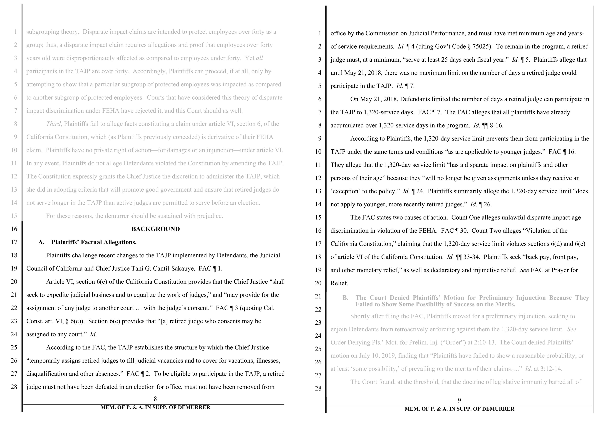

# Legal Document RAG Preprocessor v2

## Objective
Pre-processes litigation filings into contextually tagged chunks for use in a RAG repository by attorneys drafting briefs.

## What This Does
Classifies and extracts basic or structural metadata from court filings in a single API call. V2 replaces an early one-image per page process: [v1](https://github.com/botlate/Court-Filings-Preprocessing-for-RAG).

**Input:** A PDF court filing + its OCR in Markdown (from PaddleOCR-VL)

**Mid-Output:** Page classifications, caption metadata, footnote index, and a merged document with footnotes inlined

**Final Output:** Text of filing, in chunks, each chunk with rich metadata.



Chunks are outputted in JSON containers:

<pre>
{
    "document_title": "DEFENDANTS' MEMORANDUM OF POINTS AND AUTHORITIES IN SUPPORT OF DEMURRER TO FIRST AMENDED COMPLAINT",
    "filing_party": "Defendants",
    "filing_date": "2024-03-15",
    "section_path": "BACKGROUND / A. Plaintiffs' Factual Allegations",
    "chunk_ID": 14,
    "document_ID": 54,
    "page_numbers": [8,9],
    "exhibit_label": null,
    "exhibit_title": null,
    "page_type": "pleading_body",
    "text": "[PDF_page_8_cont.] A. Plaintiffs' Factual Allegations.

Plaintiffs challenge recent changes to the TAJP implemented by Defendants, the Judicial Council of California and Chief Justice Tani G. Cantil-Sakauye. FAC ¶ 1.

Article VI, section 6(e) of the California Constitution provides that the Chief Justice 'shall seek to expedite judicial business and to equalize the work of judges,' and 'may provide for the assignment of any judge to another court … with the judge's consent.' FAC ¶ 3 (quoting Cal. Const. art. VI, § 6(e)). Section 6(e) provides that '[a] retired judge who consents may be assigned to any court.' Id.

According to the FAC, the TAJP establishes the structure by which the Chief Justice 'temporarily assigns retired judges to fill judicial vacancies and to cover for vacations, illnesses, disqualification and other absences.' FAC ¶ 2. To be eligible to participate in the TAJP, a retired judge must not have been defeated in an election for office, must not have been removed from office by the Commission on Judicial Performance, and must have met minimum age and years-of-service requirements. Id. ¶ 4 (citing Gov't Code § 75025). To remain in the program, a retired judge must, at a minimum, 'serve at least 25 days each fiscal year.' Id. ¶ 5. Plaintiffs allege that until May 21, 2018, there was no maximum limit on the number of days a retired judge could participate in the TAJP. Id. ¶ 7."
}
</pre>


    "document_title": "DEFENDANTS' MEMORANDUM OF POINTS AND AUTHORITIES IN SUPPORT OF DEMURRER TO FIRST AMENDED COMPLAINT",
    "filing_party": "Defendants",
    "filing_date": "2024-03-15",
    "section_path": "BACKGROUND / A. Plaintiffs’ Factual Allegations",
    "chunk_ID": 14,
    "document_ID": 54,
    "page_numbers": [8,9],
    "exhibit_label": null,
    "exhibit_title": null,
    "page_type": "pleading_body",
    "text": "[PDF_page_8_cont.] A. Plaintiffs’ Factual Allegations.\n\nPlaintiffs challenge recent changes to the TAJP implemented by Defendants, the Judicial\nCouncil of California and Chief Justice Tani G. Cantil-Sakauye. FAC ¶ 1.\n\nArticle VI, section 6(e) of the California Constitution provides that the Chief Justice \"shall\nseek to expedite judicial business and to equalize the work of judges,\" and \"may provide for the\nassignment of any judge to another court … with the judge’s consent.\" FAC ¶ 3 (quoting Cal.\nConst. art. VI, § 6(e)). Section 6(e) provides that \"[a] retired judge who consents may be\nassigned to any court.\" Id.\n\nAccording to the FAC, the TAJP establishes the structure by which the Chief Justice\n\"temporarily assigns retired judges to fill judicial vacancies and to cover for vacations, illnesses,\ndisqualification and other absences.\" FAC ¶ 2. To be eligible to participate in the TAJP, a retired\njudge must not have been defeated in an election for office, must not have been removed from\n\n[PDF_page_9] MEM. OF P. & A. IN SUPP. OF DEMURRER\n\noffice by the Commission on Judicial Performance, and must have met minimum age and years-\nof-service requirements. Id. ¶ 4 (citing Gov’t Code § 75025). To remain in the program, a retired\njudge must, at a minimum, \"serve at least 25 days each fiscal year.\" Id. ¶ 5. Plaintiffs allege that\nuntil May 21, 2018, there was no maximum limit on the number of days a retired judge could\nparticipate in the TAJP. Id. ¶ 7."

    "document_title": "DEFENDANTS' MEMORANDUM OF POINTS AND AUTHORITIES IN SUPPORT OF DEMURRER TO FIRST AMENDED COMPLAINT",
    "filing_party": "Defendants",
    "filing_date": "2024-03-15",
    "section_path": "BACKGROUND / A. Plaintiffs’ Factual Allegations",
    "chunk_ID": 15,
    "document_ID": 54,
    "page_numbers": [9],
    "exhibit_label": null,
    "exhibit_title": null,
    "page_type": "pleading_body",
    "text": "[PDF_page_9_cont] On May 21, 2018, Defendants limited the number of days a retired judge can participate in\nthe TAJP to 1,320-service days. FAC ¶ 7. The FAC alleges that all plaintiffs have already\naccumulated over 1,320-service days in the program. Id. ¶¶ 8-16.\n\nAccording to Plaintiffs, the 1,320-day service limit prevents them from participating in the\nTAJP under the same terms and conditions “as are applicable to younger judges.\" FAC ¶ 16.\nThey allege that the 1,320-day service limit “has a disparate impact on plaintiffs and other\npersons of their age\" because they \"will no longer be given assignments unless they receive an\n'exception' to the policy.\" Id. ¶ 24. Plaintiffs summarily allege the 1,320-day service limit “does\nnot apply to younger, more recently retired judges.\" Id. ¶ 26.\n\nThe FAC states two causes of action. Count One alleges unlawful disparate impact age\ndiscrimination in violation of the FEHA. FAC ¶ 30. Count Two alleges \"Violation of the\nCalifornia Constitution,\" claiming that the 1,320-day service limit violates sections 6(d) and 6(e)\nof article VI of the California Constitution. Id. ¶¶ 33-34. Plaintiffs seek \"back pay, front pay,\nand other monetary relief,\" as well as declaratory and injunctive relief. See FAC at Prayer for\nRelief."


# Purpose
Standard RAG systems don't work well for legal documents because they ignore context. The same text means different things depending on whether it's in a complaint vs. a motion, the main argument vs. an exhibit, or plaintiff's allegation vs. defendant's characterization. When it was filed and by whom matters.

This system extracts and embeds in each chunk the minimum background knowledge a litigator would need to make sense of that chunk independently: what document it's from, which part, who filed it and when, and what argument section it belongs to. Each chunk becomes a self-contained unit with enough context for useful legal retrieval.

For the philosophy behind this, see [the v1 readme.](https://github.com/botlate/Court-Filings-Preprocessing-for-RAG#why-standard-rag-fails-for-legal-work)

## Pipeline Scripts

| Script | Role |
|--------|------|
| `13_text_classifier.py` | Core engine. Sends full document text + page 1 image to OpenAI. Returns structured JSON with page classifications, caption, exhibits, footnotes, and causes of action. Optional Pass 2 for image review. |
| `merge_footnotes.py` | Merges footnotes inline using the authority split. LLM identifies footnote locations; text is pulled verbatim from OCR source. |
| `review_footnotes.py` | Standalone CLI tool for validating footnote detection. |
| `text_classifier_gui.py` | Tkinter GUI. Scans a folder for `*_combined.md` files, provides buttons for classification and footnote merging. |

## Usage

### Requirements
- Python 3.9+
- OpenAI API key (set as `OPENAI_API_KEY` environment variable)
- [PaddleOCR-VL](https://github.com/PaddlePaddle/PaddleOCR) to produce Markdown from PDFs (the pipeline relies on its structured output)

### OCR Input Format

The pipeline expects PaddleOCR-style Markdown with page delimiters:
```
---[Start PDF page 1]---
(page content)
---[End PDF page 1]---
```
Place the `.md` file in the same folder as the source PDF:
```
PDFs/
  SomeDocument.pdf
  SomeDocument_combined.md
```

### Running

```bash
# Classify a single document
python code/13_text_classifier.py PDFs/SomeDocument_combined.md

# Merge footnotes after classification
python code/merge_footnotes.py PDFs/SomeDocument_combined.md

# Or use the GUI
python code/text_classifier_gui.py
```

### Output Structure
```
PDFs/
  SomeDocument.pdf
  SomeDocument_combined.md
  SomeDocument_combined_classification/
    SomeDocument_combined_classification_text.csv   # Page-by-page classifications
    SomeDocument_combined_caption_text.txt           # Extracted caption metadata (JSON)
    SomeDocument_combined_text_classification_raw.json
    SomeDocument_combined_footnote_index.csv         # Footnotes with page numbers and text
    manifest.json                                    # Full structured output
    sent_images/                                     # Images sent to the API (for debugging)
  SomeDocument_combined_fn_merged.md                 # Document with footnotes inlined
```


### Selective Image Usage

Page images are still used, but selectively:

- **Page 1 (always):** The caption page image is sent alongside the text in Pass 1 for cross-checking filing dates, court stamps, and other visual elements that OCR may miss.
- **Other pages (at AI's discretion):** If Pass 1 flags specific pages as needing visual review — garbled OCR, handwritten content, stamped dates, visual elements — those page images are extracted from the source PDF and sent in a targeted Pass 2. Results are merged back, preferring the image for visual elements and the text for typed content.

Most documents need only Pass 1. The test filing in this repo (a 22-page opposition brief) completed in 30 seconds with no Pass 2 needed.

---

## Anti-Hallucination Architecture

The LLM classifies and locates information but never provides final text for high-precision fields. Instead:

- The **LLM** is authoritative for **location and classification** — which footnotes exist, what pages they're on, document structure, page categories
- The **OCR source Markdown** is authoritative for **text content** — footnote text, document titles, exhibit labels

For search-constrained fields, the LLM returns `{search_text, page}` as search parameters. A Python function finds the exact match in the source Markdown (after whitespace normalization) and copies the verbatim text. If the search fails, the field is flagged — not populated with the LLM's version.

The search function's source code is embedded in the prompt so the LLM can see exactly what its output will be tested against.

---


## What Changed from v1

The [original pipeline](https://github.com/botlate/Court-Filings-Preprocessing-for-RAG) was built when LLM context windows were ~50K tokens and hallucination rates were higher. It processed one page image at a time across 10+ scripts, stitching results together afterward. That worked but was slow, fragile, and couldn't see full document context when classifying individual pages.

Two things changed that made the old approach unnecessary:

1. **PaddleOCR-VL** now produces clean, structured Markdown from PDFs with minimal to no cleanup needed. This eliminates the need to send page images for text extraction — the OCR output is reliable enough to serve as the primary input.
2. **Larger context windows** (1M+ tokens on current models) mean an entire filing's text fits in a single API call.

Together, these let the full OCR text of a filing (often 50-100+ pages) go to the LLM at once. The LLM classifies every page, extracts the caption, identifies exhibits, tracks footnotes, and maps section headings — all with the full document in view.

For very large filings that exceed the context window, later versions will split across multiple API calls, targeting a maximum of 80% of the model's token limit per call.


## Coming Soon

- **TOC extraction and formatting** — The classifier identifies TOC pages but doesn't yet extract or structure the table of contents
- **Chunking** — Section-aware chunking using TOC structure (for documents with a TOC) and semantic chunking (for documents without). The manifest already has placeholder fields for chunk IDs.

---

## Why Context Matters for Legal RAG

Standard RAG systems don't work well for legal documents because they ignore context. The same text means different things depending on whether it's in a complaint vs. a motion, the main argument vs. an exhibit, or plaintiff's allegation vs. defendant's characterization.

Consider: a defendant's motion summarizes plaintiff's fifth cause of action as alleged in the third amended complaint. This should not be used to understand what the fifth cause of action actually asserts, only what the defendant claims it asserts. Without contextual tagging, retrieval returns flotsam. Each chunk must carry the minimum background knowledge a litigator would need to make sense of it independently.

[More on this thinking in the v1 readme.](https://github.com/botlate/Court-Filings-Preprocessing-for-RAG#why-standard-rag-fails-for-legal-work)

---

## License

MIT License

Copyright (c) 2025 Rye Murphy

Permission is hereby granted, free of charge, to any person obtaining a copy
of this software and associated documentation files (the "Software"), to deal
in the Software without restriction, including without limitation the rights
to use, copy, modify, merge, publish, distribute, sublicense, and/or sell
copies of the Software, and to permit persons to whom the Software is
furnished to do so, subject to the following conditions:

The above copyright notice and this permission notice shall be included in all
copies or substantial portions of the Software.

THE SOFTWARE IS PROVIDED "AS IS", WITHOUT WARRANTY OF ANY KIND, EXPRESS OR
IMPLIED, INCLUDING BUT NOT LIMITED TO THE WARRANTIES OF MERCHANTABILITY,
FITNESS FOR A PARTICULAR PURPOSE AND NONINFRINGEMENT. IN NO EVENT SHALL THE
AUTHORS OR COPYRIGHT HOLDERS BE LIABLE FOR ANY CLAIM, DAMAGES OR OTHER
LIABILITY, WHETHER IN AN ACTION OF CONTRACT, TORT OR OTHERWISE, ARISING FROM,
OUT OF OR IN CONNECTION WITH THE SOFTWARE OR THE USE OR OTHER DEALINGS IN THE
SOFTWARE.
